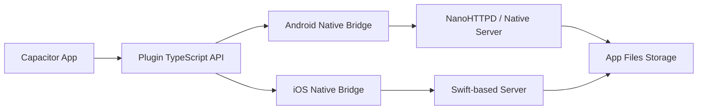

# Architecture - Local HTTP Server

The `cap-http-server` plugin provides a bridge between Capacitor and a native HTTP server implementation on Android and iOS.

## Component Diagram

## Internal Workflow

1. **Initialization**: The plugin starts without an active server.
2. **Starting**: When `startServer()` is called, the native side selects an available port and starts an HTTP server thread.
3. **File Serving**: The server is configured to serve files from a specific internal directory (e.g., `/data/user/0/com.zenda.app/files/app-b`). If the `HTTP_SERVER_BASE_DIR` meta-data is specified in the AndroidManifest.xml or Info.plist, the server will serve files from that directory instead.
4. **Stopping**: `stopServer()` terminates the server thread and releases the port.

## Performance Considerations

- The server should run on a background thread to avoid blocking the UI.
- Use lightweight HTTP server implementations to minimize memory and CPU usage.
